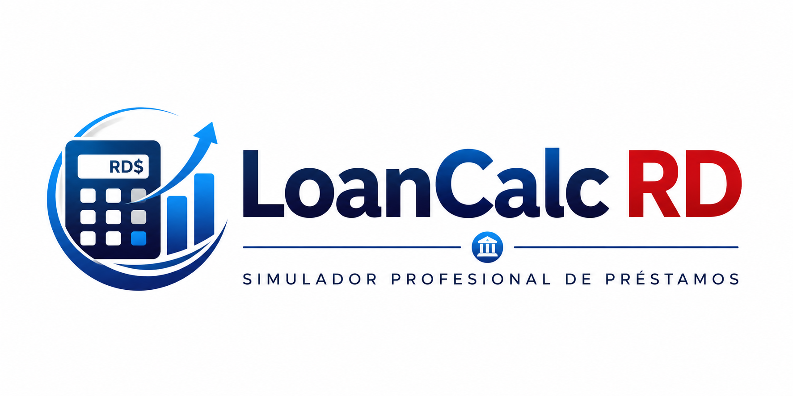

<p align="center">
  
</p>

<p align="center">
  
</p>

<p align="center">
  
</p>

<p align="center">
  <strong>Simulador financiero dominicano para calcular, analizar y comparar préstamos amortizados.</strong><br>
  Desarrollado con Angular y TypeScript.
</p>

<p align="center">
  
  
  
</p>

---

## 📖 Descripción

**LoanCalc RD** es una aplicación web orientada al mercado dominicano que permite simular préstamos amortizados mediante el método francés. Calcula automáticamente la cuota mensual, los intereses, el total pagado y el calendario completo de amortización.

La versión 2.0 amplía el proyecto con herramientas de análisis, comparación, exportación, historial local, visualizaciones financieras, tema oscuro y validación real de cédula dominicana mediante checksum Luhn.

El proyecto nació en **2020** como un ejercicio práctico propuesto por **Gerson Santos Mateo** para fortalecer el aprendizaje de Angular. En **2026** fue reconstruido y evolucionado hasta convertirse en una aplicación moderna, responsive y accesible.

---

## 🛠️ Tecnologías utilizadas

<p align="center">
  
</p>

| Tecnología | Uso principal |
|---|---|
| 🅰️ Angular | Desarrollo del frontend |
| 📘 TypeScript | Lógica de negocio y tipado |
| 🌐 HTML5 | Estructura semántica y accesible |
| 🎨 CSS3 | Diseño responsive y tema oscuro |
| 🅱️ Bootstrap 5 | Componentes y utilidades visuales |
| 📄 jsPDF | Generación de reportes PDF |
| 📑 jsPDF AutoTable | Tabla de amortización en PDF |
| 🔳 QRCode | Código QR en los reportes |
| 📊 SpreadsheetML | Exportación compatible con Excel |
| 🧪 Vitest | Pruebas automatizadas |

---

## ✨ Funcionalidades

### 👤 Datos del solicitante

- ✅ Nombre y apellido.
- ✅ Fecha de nacimiento y cálculo automático de edad.
- ✅ Formato automático de cédula `000-0000000-0`.
- ✅ Validación de cédula dominicana mediante algoritmo Luhn.
- ✅ Mensajes de validación accesibles y específicos.

### 💰 Simulación del préstamo

- ✅ Préstamos personales, hipotecarios, de vehículo, educativos y comerciales.
- ✅ Monto, tasa anual y plazo en meses.
- ✅ Cálculo de cuota mensual.
- ✅ Cálculo de capital, intereses y total a pagar.
- ✅ Manejo de préstamos con tasa de interés igual a cero.
- ✅ Calendario completo de pagos.

### 📊 Análisis financiero

- ✅ Distribución visual entre capital e intereses.
- ✅ Gráfica de evolución del balance restante.
- ✅ Tabla de amortización responsive.
- ✅ Comparador de escenarios por entidad financiera.
- ✅ Identificación automática de la opción con menor cuota.

> Las tasas del comparador son introducidas por el usuario y no representan ofertas oficiales de entidades financieras.

### 📤 Exportación y uso compartido

- ✅ Reporte profesional en PDF.
- ✅ Logo, número de reporte y código QR.
- ✅ Numeración automática de páginas.
- ✅ Exportación compatible con Microsoft Excel.
- ✅ Compartir por WhatsApp, Facebook y LinkedIn.
- ✅ Copiar resumen financiero al portapapeles.

### 🕘 Historial y personalización

- ✅ Historial local de hasta 20 simulaciones.
- ✅ Carga de simulaciones anteriores.
- ✅ Eliminación individual o limpieza completa.
- ✅ Tema claro y oscuro persistente.
- ✅ Compatibilidad con la preferencia visual del sistema.

### ♿ Accesibilidad y responsive

- ✅ Navegación mediante teclado.
- ✅ Foco visible.
- ✅ Etiquetas ARIA y regiones accesibles.
- ✅ Contraste optimizado.
- ✅ Compatibilidad con reducción de movimiento.
- ✅ Diseño adaptado para móviles, tabletas y escritorio.

---

## 📂 Estructura principal

```text
CalculadoraPrestamos
│
├── calculadora-prestamos
│   ├── src
│   │   ├── app
│   │   │   ├── core
│   │   │   │   ├── models
│   │   │   │   ├── services
│   │   │   │   └── validators
│   │   │   ├── pages
│   │   │   │   ├── calculator
│   │   │   │   └── results
│   │   │   └── shared
│   │   └── assets
│   │       └── img
│   ├── angular.json
│   ├── package.json
│   └── package-lock.json
│
├── LICENSE
├── THIRD_PARTY_NOTICES.md
└── README.md
```

---

## 🚀 Instalación y ejecución

### 1. Clonar el repositorio

```bash
git clone https://github.com/Jairo0811/CalculadoraPrestamos.git
cd CalculadoraPrestamos/calculadora-prestamos
```

### 2. Instalar dependencias

```bash
npm install
```

### 3. Ejecutar en desarrollo

```bash
npm start
```

La aplicación estará disponible en:

```text
http://localhost:4200
```

### 4. Compilar para producción

```bash
npm run build
```

### 5. Ejecutar pruebas

```bash
npm test
```

Para integración continua:

```bash
npm run test:ci
```

---

## 📊 Estado del proyecto

| Módulo | Estado |
|---|:---:|
| 👤 Datos del solicitante | ✅ |
| 🇩🇴 Validación Luhn de cédula | ✅ |
| 💰 Simulación de préstamos | ✅ |
| 📊 Tabla de amortización | ✅ |
| 📈 Visualizaciones financieras | ✅ |
| 🏦 Comparador de escenarios | ✅ |
| 📄 Exportación PDF | ✅ |
| 📗 Exportación Excel | ✅ |
| 🔳 Código QR | ✅ |
| 📤 Compartir simulación | ✅ |
| 🕘 Historial local | ✅ |
| 🌙 Tema oscuro | ✅ |
| ♿ Accesibilidad | ✅ |
| 📱 Responsive Design | ✅ |
| 🧪 Pruebas automatizadas | ✅ |

---

## 💡 Origen del proyecto

LoanCalc RD fue inspirado en el siguiente ejercicio propuesto en 2020 por **Gerson Santos Mateo**:

> “El ejercicio después que tengas todo eso estudiado será hacer una calculadora de préstamos amortizada, donde el usuario pueda insertar la cantidad que desea prestada, seleccionar los años que tendrá el préstamo y por último seleccionar qué tipo de préstamo será: hipotecario, automotriz o personal.”

Este proyecto representa la evolución de aquella idea inicial hacia una aplicación financiera moderna.

---

## 📜 Licencia y atribuciones

LoanCalc RD se distribuye bajo la **Licencia MIT**. Consulta el archivo [`LICENSE`](LICENSE).

La validación de cédula mediante Luhn fue adaptada de la implementación pública de **OGTIC Cuenta Única Registry**, también licenciada bajo MIT. Consulta [`THIRD_PARTY_NOTICES.md`](THIRD_PARTY_NOTICES.md).

---

## 👨‍💻 Autor

**Francis Jairo Matías Rosario**

Idea original del ejercicio: **Gerson Santos Mateo**

---

<p align="center">
  Desarrollado con ❤️ utilizando Angular<br>
  LoanCalc RD · 2020 — Presente
</p>
